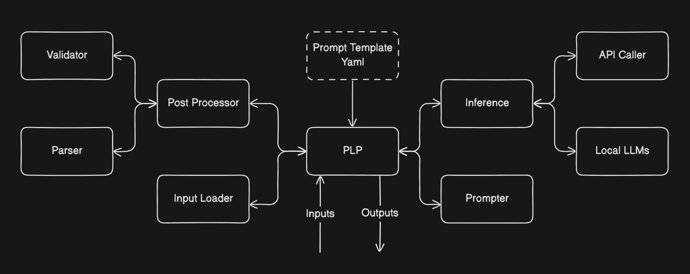

# PLP – Personalized Landing‑Page Generator

## Purpose
Automates generation of marketing landing‑page copy (headline, subheadline) from existing creative assets and market insights using an LLM. Validates output HTML and stores structured results for downstream integration.

## Workflow


## Key Features
- **Prompt Construction** – Builds multimodal chat prompts combining text and Base64‑encoded image.
- **LLM Inference** – Supports OpenAI models (default `gpt-4.1`), expandable for local models.
- **Post‑Processing** – JSON parsing, HTML sanity checks, schema validation, error cataloguing.
- **Autoretry** – Reprompts on validation failures up to a configurable retry limit.
- **Structured Logging** – Persists full interaction trace and final JSON result under `logs/`.

## Repository Layout
```
src/
  inference/           # OpenAI & future model wrappers
  postprocessing/      # Parser, Validator, PostProcessor
  util/                # FileLoader, enums, helpers
  plp.py               # Pipeline entry‑point class
resources/
  prompt_template.yaml # YAML template with system/user/reprompt blocks
  test.png             # Sample image for quick run
tests/                 # pytest suites
logs/                  # Auto‑generated JSON run logs
```

## Requirements
- Python ≥ 3.10  
- `pip install -r requirements.txt`

Main runtime libraries:
```
openai
python-dotenv
PyYAML
lxml
```

## Configuration
Create `.env.dev` (or `.env`) with:
```
OPENAI_API_KEY=sk-…
```

Optional environment variables:
```
OPENAI_API_BASE=…
OPENAI_API_MODEL=gpt-4.1
```

Edit `resources/prompt_template.yaml` to tune system prompt, user prompt placeholders, and reprompt texts.

Module can be initialized in another module by the follwoing line:
`plp = PLP(inputs=inputs)`

Inputs need to be in a dictionary in the following format :
```
inputs = {
    "original_headline_html": "<original headline html here>",
    "original_subheadline_html": "<original subheadline html here>",
    "marketing_insights_text": "<marketing insights text here>",
    "image_path": "<path of image here>"
}
```
## Quick Start
```bash
conda create --name code
source setup.sh
pip install -r requirements.txt

python -m src.plp  # uses sample inputs defined in plp.py __main__
```

### Custom Run
```python
from src.plp import PLP

inputs = {
    "original_headline_html": "<h1>Original headline</h1>",
    "original_subheadline_html": "<p>Original subheadline</p>",
    "marketing_insights_text": "Long form marketing brief…",
    "image_path": "path/to/hero.png",
}

plp = PLP(inputs=inputs, num_retries=2)
result = plp.plp_main()
```

## Output Schema
```jsonc
{
  "headline":   "<h1>…</h1>",
  "subheadline":"<p>…</p>"
}
```
The HTML strings must be well‑formed; the validator rejects malformed markup.

## Error Codes
See `src/util/data_types.py` for enum values including:
- `JSON_PARSING_ERROR`
- `HTML_HEADLINE_PARSING_ERROR`
- `HTML_SUBHEADLINE_PARSING_ERROR`
- `KEY_MISSING_ERROR`

## Testing
```bash
pytest -q
```
Includes success and failure scenarios for prompt construction, parsing, and HTML validation.

## Extending
- **Local Models** – Implement `_get_local_inference` in `src/inference/inference.py`.
- **Additional Validation** – Augment `Validator` with new HTML or business‑rule checks.
- **Visualization** - Could use Streamlit to load inputs and obtain necessary outputs. can be made into a one-tab visualizations. For local models, can also enter Huggingface models and enable loading of local models through streamlit.

